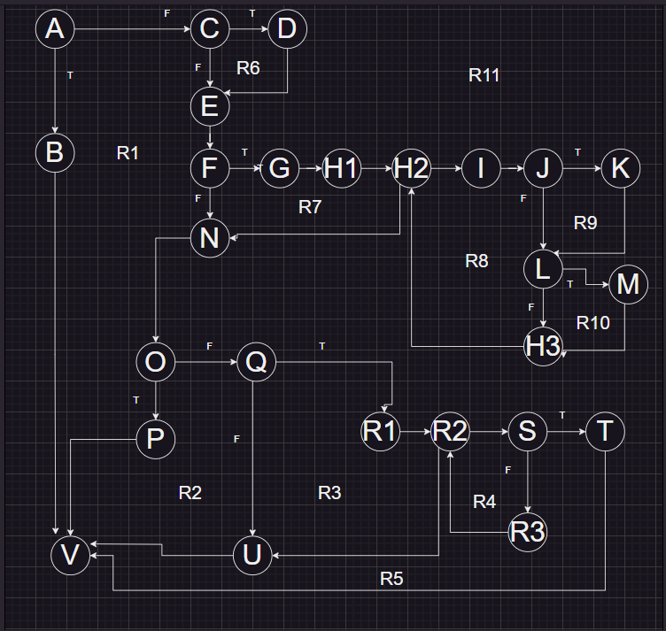

# Ангела Бојкова 216048 
## Control Flow Graph 
 
## Цикломатска комплексност
Цикломатскта комплексност ја добив така што ги изброив бројот на региони кои ги имам кои исто така се означени на графот, вкупно се 11, значи цикломатската комплексност е 11.

## Every Branch
 
Тест случаи според EveryBranch  
Имам вкупно 5 тест случаи:  
1)Првиот тест случај ми е за RuntimeException. 
2)Вториот тест случај ми е за вториот if услов кога нема да внесам корисничко име и како корисничко име да се постави емаил адресата  
3)Третиот тест случај ми е за if условот кога се проверува дали email-от содржи @ и . и за if условот кога се провеерува дали во пасвордор има некој делови што се совпаѓаат со username или должината на пасвордот е помала од 8.  
4)Четвртиот тест случај ми е кога во лозинката има празно место и да го помини гранењето до  Q во U  
5)Петиот тест пример ми е за проверката дали има специјален карактер во лозинката  
 
    @Test  
    void EveryBranch() {  
        RuntimeException ex;  
        ex = assertThrows(RuntimeException.class, () -> SILab2.function(new User("Ana", "ANABANANA", null), null));  
        assertTrue(ex.getMessage().contains("Mandatory information missing!"));  
        User user1 = new User( null, "LUBENICKA*", "ana1@gmail.com");   
        SILab2.function(user1, createList(new User ("ana1@gmail.com", "LUBENICKA*", "ana1@gmail.com"))); 
        assertEquals(user1.getEmail(), user1.getUsername()  );  
        User user2 = new User("Stefan" , "STEFANATOR*", "stefangmail.com"); 
        SILab2.function(user2, createList(new User("Stefan" , "STEFANATOR*", "stefangmail.com"))); 
        assertFalse(user2.getEmail().contains("@") && user2.getEmail().contains(".")); 
        assertTrue(user2.getPassword().toLowerCase().contains(user2.getUsername().toLowerCase()) || user2.getPassword().length()<8);  
        User user3 = new User("Angela" , "ANA BANANA", "angela@gmail.com"); 
        SILab2.function(user3, createList(new User("Angela" , "ANA BANANA", "angela@gmail.com"))); 
        assertTrue(user3.getPassword().contains(" "));  
        User user4 = new User("Angela" , "ANABANANA", "angela@gmail.com"); 
        boolean rez = SILab2.function(user4, createList(new User("Angela" , "ANABANANA", "angela@gmail.com"))); 
        assertFalse(rez);  
       String specialCharacters = "!#$%&'()*+,-./:;<=>?@[]^_{|}";  
        int spec_cnt=0;  
        for (int i = 0; i < specialCharacters.length(); i++) {  
            if (user4.getPassword().contains(String.valueOf(specialCharacters.charAt(i)))) {  
                spec_cnt++; 
            }  
        }  
        assertEquals(0, spec_cnt);  
    }   

## Тест случаи според критериумот Multiple Condition
if (user==null || user.getPassword()==null || user.getEmail()==null)  
// T X X //кога нема да внесиме user  
// F T X //кога ќе внесиме user но нема да внесиме пасворд  
// F F T //кога ќе внесиме user и ќе внесиме пасвор но нема да внесиме емаил  
// F F F //кога ќе внесиме user со пасворд и емаил  
 
    @Test  
    void MultipleCondition(){  
        RuntimeException ex;  
        // if (user==null || user.getPassword()==null || user.getEmail()==null){  
        //T X X  
        //F T X  
        //F F T  
        //F F F  
        ex = assertThrows(RuntimeException.class, () -> SILab2.function(null , createList(new User ("ana1@gmail.com", "LUBENICKA*", "ana1@gmail.com"))));  
        assertTrue(ex.getMessage().contains("Mandatory information missing!"));  
        ex = assertThrows(RuntimeException.class, () -> SILab2.function(new User("Ana", null, "ana@gmail.com"), createList(new User ("ana1@gmail.com", "LUBENICKA*", "ana1@gmail.com"))));  
        assertTrue(ex.getMessage().contains("Mandatory information missing!"));  
        ex = assertThrows(RuntimeException.class, () -> SILab2.function(new User("Ana", "Ana", null), createList(new User ("ana1@gmail.com", "LUBENICKA*", "ana1@gmail.com"))));  
        assertTrue(ex.getMessage().contains("Mandatory information missing!"));  
        Boolean pr =SILab2.function(new User("ANA", "ANABANANA", "ana1@gmail.com"), createList(new User ("ana1@gmail.com", "LUBENICKA*", "ana1@gmail.com")));  
        assertFalse(pr);  
    }  
## Објаснување за напишаните Unit тестови  
Unit тестовите ги напишав на начин да се исполнат сите услови и да може да се помини exception-от. Со употреба на assertThrows се фаќа exception, a за да може да проверам дали се фрлил соодветниот exception користев assertTrue за дадениот влез. Исто така употребив и assertTrue, assertFalse и asserEquals за да се провери дали програмата го враќа точниот резултат за дадениот input.
Со multiple condition се проверува if условот каде што има повеќе од еден услов. Исто така и овде користев assertThrows и assertTrue за фаќање и проверување дали е точен даден exception.

